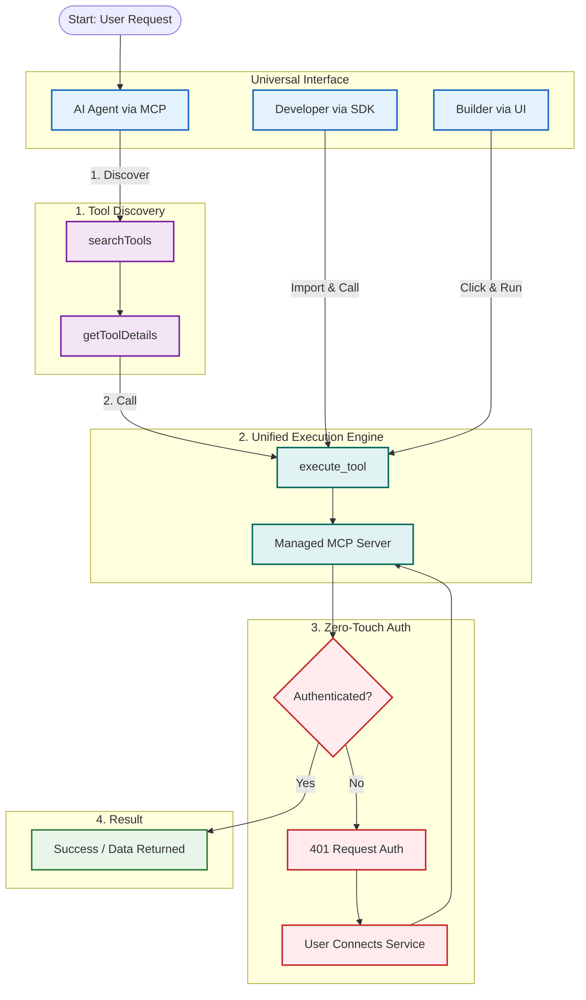

# DataGen Agent Workflow

This flowchart illustrates the standard lifecycle of an AI agent building and executing applications using the DataGen SDK.

## Core Benefit: Universal MCP Interface

A key advantage of this architecture is that **every tool is an MCP tool**. This means the exact same tool definitions, schemas, and execution paths are used by:
1.  **AI Agents**: Discovering and calling tools dynamically via the Model Context Protocol.
2.  **Human Developers**: Importing and running tools via the Python SDK.
3.  **Low-Code Builders**: Using tools within the DataGen UI.

This unification eliminates "glue code" and ensures that if a tool works for a developer, it works for the agent, and vice versa.

### Mermaid Diagram Source

