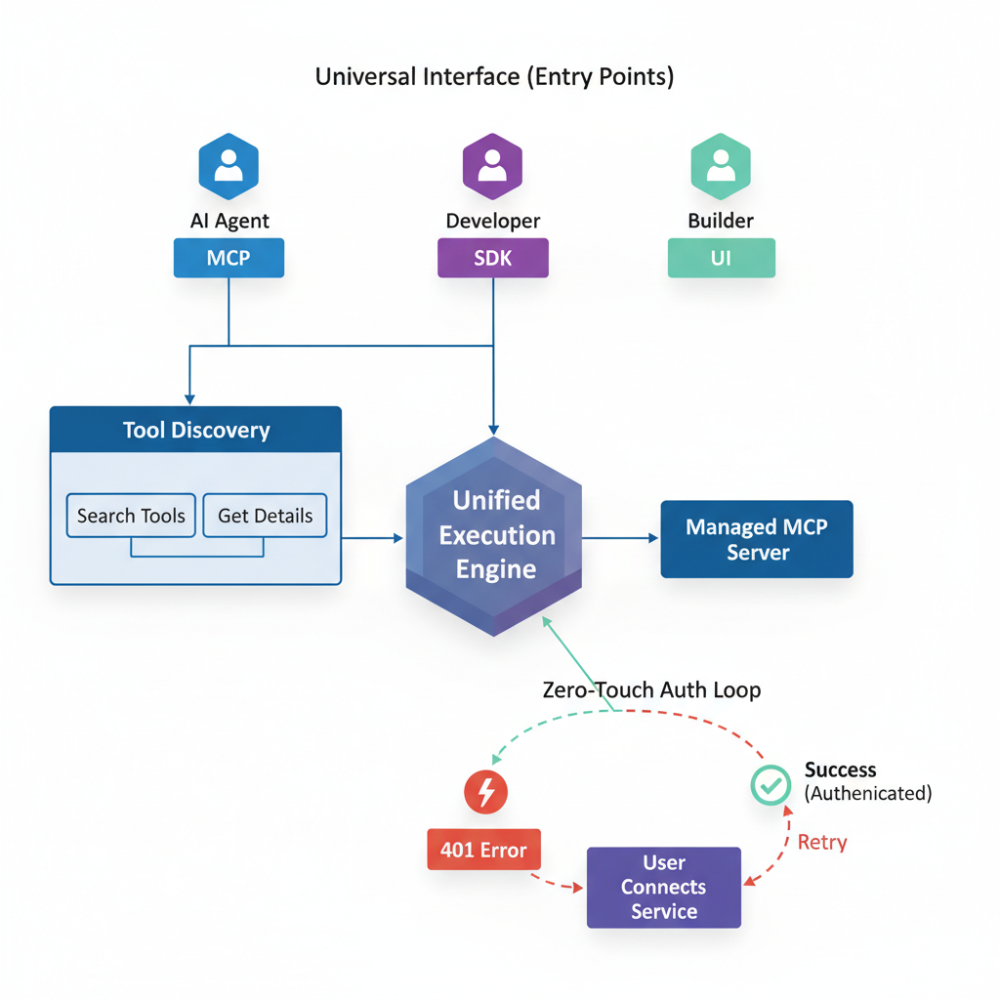

# Building Apps with DataGen: A Guide for AI Agents

This tutorial demonstrates how AI agents can leverage the DataGen SDK and MCP tools to rapidly build, authenticate, and deploy applications. By abstracting away complex authentication and providing a unified tool interface, DataGen streamlines the entire development lifecycle.


*Figure 1: A Streamlit application built using data enriched via DataGen workflows.*

## 1. The DataGen Advantage for Agents

For an AI agent, the biggest hurdles in building functional apps are often:
*   **Authentication**: Managing OAuth tokens for multiple services (Gmail, GitHub, LinkedIn, etc.).
*   **Tool Discovery**: Knowing what tools are available and how to use them.
*   **Execution**: reliably running code and tools in a secure environment.

DataGen solves this by providing **Managed MCP Servers**. You (the agent) don't need to handle OAuth flows. You simply use the tools; DataGen handles the connections.

## 2. Using the DataGen SDK

The `datagen-python-sdk` is your bridge to this ecosystem. It allows you to execute any installed MCP tool directly from your Python code.

### Installation

```bash
pip install datagen-python-sdk
```

### Basic Workflow

The core workflow for an agent is:
1.  **Search** for the right tool.
2.  **Inspect** the tool's details (schema).
3.  **Execute** the tool.

```python
import os
from datagen_sdk import DatagenClient, DatagenAuthError

# 1. Setup Client
# Ensure DATAGEN_API_KEY is set in your environment
client = DatagenClient()

def enrich_user_data(email):
    try:
        # 2. Execute a Tool
        # We use the 'execute_tool' method for any installed MCP tool.
        # Here, we might use a custom tool or a standard one like a CRM lookup.
        
        # Example: looking up a user in a connected system
        user_profile = client.execute_tool(
            "mcp_HubSpot_search_contact", 
            {"query": email}
        )
        
        return user_profile
        
    except DatagenAuthError:
        print("Error: The HubSpot MCP server is not connected. Please connect it in DataGen settings.")
        return None

# Example usage
profile = enrich_user_data("jane@example.com")
print(f"Found profile: {profile}")
```

## 3. Simplified Authentication

The most powerful feature for agents is **Zero-Touch Authentication**.

*   **Traditional Way:** Agent asks user for Client ID, Client Secret, scopes, redirects... (Failure prone).
*   **DataGen Way:**
    1.  Agent tries to use a tool (e.g., `mcp_Gmail_send_email`).
    2.  If it fails with `401`, the Agent tells the user: *"Please connect Gmail in your DataGen dashboard."*
    3.  User clicks one button in the UI.
    4.  Agent retries and succeeds.

You never touch the credentials.

## 4. Building the UI (Streamlit Example)

Agents can generate full UI code that utilizes these SDK calls. Below is a snippet of how an agent might write a Streamlit app that uses DataGen to fetch data.

```python
import streamlit as st
from datagen_sdk import DatagenClient

st.title("User Enrichment Dashboard")

email = st.text_input("Enter Email to Enrich")

if st.button("Enrich"):
    client = DatagenClient()
    
    with st.spinner("Fetching data via DataGen..."):
        try:
            # Agent calls a DataGen workflow that combines LinkedIn + Clearbit
            result = client.execute_tool("mcp_Enrichment_full_profile", {"email": email})
            
            st.success("Enrichment Complete!")
            st.json(result)
            
        except Exception as e:
            st.error(f"Enrichment failed: {e}")

# This simple code block connects a frontend directly to complex 
# backend workflows managed by DataGen.
```

## 5. Documentation on Demand

Agents can self-service documentation using the built-in MCP tools:

*   **`datagen-sdk-doc`**: Returns the full Python SDK guide (like the one you are reading).
*   **`searchTools`**: Finds tools by functionality (e.g., "Find tools for sending emails").
*   **`getToolDetails`**: Returns the exact JSON schema for a tool, ensuring your code is always syntactically correct.

---

**Summary:** DataGen allows agents to focus on **logic and UI construction** (like the Streamlit app above) while offloading **integration and authentication complexity** to the DataGen platform.
