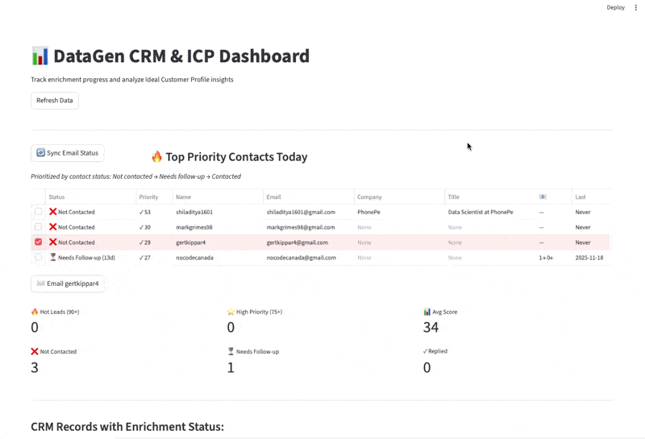

# Building Apps with DataGen: A Guide for Vibe Coders

This tutorial shows how developers and AI agents can rapidly build data-rich applications without wrestling with OAuth, API docs, or SDK complexity. With DataGen, integrated services become simple function calls - write `client.execute_tool()` instead of reading 12 pages of API documentation.


*Figure 1: DataGen's MCP Gateway architecture - one client handles auth and routing to Gmail, Neon, LinkedIn. Write simple execute_tool() calls, skip all SDK setup*



*Figure 2: A real-world CRM dashboard built with DataGen - easily integrate Neon, Gmail, and LinkedIn with one client*

## 1. The DataGen Advantage for Vibe Coders

The biggest hurdles when building data-rich applications are:
*   **Authentication Hell**: Setting up OAuth flows, managing tokens, handling refreshes for every service
*   **Tool Discovery**: Reading API docs, finding the right SDK, understanding rate limits
*   **MCP Server Management**: Adding new MCP servers means dealing with each one's authentication separately

DataGen solves this with two key features:

### 1. MCP Gateway with Unified Auth
DataGen MCP Server acts as a gateway that handles authentication for ALL connected MCP servers. Add Gmail, LinkedIn, Neon, any MCP server - DataGen handles the auth once, your code never touches credentials.

### 2. Built-in Tool Discovery via MCP Tools
*   AI agents use `searchTools` MCP tool (NOT code) to find available tools
*   AI agents use `getToolDetails` MCP tool (NOT code) to understand tool schemas
*   Agents guide themselves → write clean execution code with just `client.execute_tool()`
*   **Human developers never write discovery code** - agents handle that part

**The result**: For AI agents helping developers, use DataGen's `searchTools` and `getToolDetails` MCP tools to discover what's available, then write simple execution code. For human developers, just use `client.execute_tool()` with the tool name the agent found. DataGen makes external services feel like native Python functions.

## 2. Using the DataGen SDK

The `datagen-python-sdk` is your bridge to this ecosystem. No Gmail SDK setup, no LinkedIn API wrappers, no OAuth configuration code - just execution.

### Installation

```bash
pip install datagen-python-sdk
```

### The Clean Developer Experience

```python
from datagen_sdk import DatagenClient

client = DatagenClient()

# Send an email - that's all the code you need
client.execute_tool(
    "mcp_Gmail_gmail_send_email",
    {
        "to": "user@example.com",
        "subject": "Welcome!",
        "body": "Thanks for signing up"
    }
)

# Query your database - same simple pattern
contacts = client.execute_tool(
    "mcp_Neon_run_sql",
    {
        "params": {
            "sql": "SELECT * FROM crm WHERE priority_score > 75",
            "projectId": "your-project-id",
            "databaseName": "your-db"
        }
    }
)
```

### 🤖 How AI Agents Guide the Process

The power of DataGen is how AI agents use MCP tools to discover and learn, then write clean code for you. **No custom integration code needed** - no Gmail SDK, no LinkedIn API setup, no OAuth flows.

**Quick overview** - When you ask an agent to "send an email via Gmail":
1. Agent uses `searchTools` MCP tool → finds "mcp_Gmail_gmail_send_email"
2. Agent uses `getToolDetails` MCP tool → learns the schema
3. Agent writes the clean `execute_tool` code above
4. Your codebase stays clean - no Gmail SDK imports, no OAuth setup, no API wrappers

**Detailed workflow example** - Here's what happens internally:

User Request: "Send a welcome email to new signups"

🤖 Agent's Process (using DataGen MCP tools):

Step 1: Agent calls searchTools MCP tool
```
Input: "send email"
Output: ['mcp_Gmail_gmail_send_email', 'mcp_Resend_send_email', ...]
```

Step 2: Agent calls getToolDetails MCP tool
```
Input: "mcp_Gmail_gmail_send_email"
Output: {
  "name": "mcp_Gmail_gmail_send_email",
  "inputSchema": {
    "properties": {
      "to": {"type": "string"},
      "subject": {"type": "string"},
      "body": {"type": "string"}
    }
  }
}
```

Step 3: Agent writes this clean code:
```python
# Python code
client.execute_tool(
    "mcp_Gmail_gmail_send_email",
    {
        "to": user.email,
        "subject": "Welcome to our platform!",
        "body": f"Hi {user.name}, thanks for signing up!"
    }
)
```

**Key distinction:**
*   **`searchTools` & `getToolDetails`** = MCP tools used BY agents to find the right tool
*   **`execute_tool`** = The ONLY code you write - no SDK setup, no API wrappers, no OAuth
*   **Result**: Your codebase skips all the integration boilerplate - just simple `execute_tool()` calls

**Traditional way** (what you avoid):
```python
# Without DataGen - lots of integration code
from google.oauth2.credentials import Credentials
from googleapiclient.discovery import build
import linkedin_api

# Gmail setup
creds = Credentials.from_authorized_user_file('token.json', SCOPES)
gmail_service = build('gmail', 'v1', credentials=creds)
message = MIMEText('email body')
# ... 20+ more lines of Gmail API code

# LinkedIn setup
linkedin = linkedin_api.Linkedin(username, password)
# ... custom API wrapper code
```

**DataGen way** (what you write):
```python
# With DataGen - just execution
client.execute_tool("mcp_Gmail_gmail_send_email", {...})
client.execute_tool("get_linkedin_person_data", {...})
```

### The Two-Layer Architecture
*   **Agent layer (MCP tools)**: `searchTools`, `getToolDetails` - guides the agent
*   **Code layer (SDK)**: `execute_tool` - clean, simple, no auth logic
*   **Gateway layer**: DataGen handles authentication for all connected MCP servers

Notice how we used Gmail and Neon PostgreSQL with the same client? That's the MCP gateway - you connect services once in DataGen's UI, and all their tools become available through one authenticated client. No credential juggling in code.

### Benefits for Vibe Coding
*   **No SDK hell** - skip Gmail SDK, LinkedIn API, OAuth setup entirely
*   **Code stays simple** - no integration boilerplate cluttering your codebase
*   **Agents self-guide** - they find and learn tools, write clean execution code
*   **Swap services easily** - change Neon → Supabase without rewriting integration code

**From the actual app**: When building the signup-enrichment dashboard shown in the figures above, there's zero Gmail SDK code, zero LinkedIn API wrappers, zero OAuth flows. Just clean `client.execute_tool()` calls. The agent handled tool discovery; the codebase stayed focused on business logic.

## 3. The MCP Gateway: One Auth to Rule Them All

Traditional MCP setup requires managing authentication for each server separately. DataGen acts as a gateway - you authenticate once per service in the UI, and all connected MCP servers' tools become available through one client.

### The Traditional Way
```python
# Managing multiple MCP server connections
gmail_client = MCPClient("gmail-server-url", gmail_auth_token)
neon_client = MCPClient("neon-server-url", neon_api_key)
linkedin_client = MCPClient("linkedin-server-url", linkedin_token)

# Different clients, different auth, different patterns...
```

### The DataGen Way
```python
# One client for everything
client = DatagenClient()

# All these work through the same gateway
client.execute_tool("mcp_Gmail_gmail_send_email", {...})
client.execute_tool("mcp_Neon_run_sql", {...})
client.execute_tool("get_linkedin_person_data", {...})
```

### Connection Flow
**MCP Servers** (Gmail, Neon, LinkedIn, etc.) → **DataGen Gateway** (handles auth) → **Your Code** (uses tools)

**How it works:**
1. User connects Gmail MCP server in DataGen dashboard (one OAuth click)
2. User connects Neon MCP server in DataGen dashboard (enters credentials once)
3. Developer/agent can now use ALL tools from both servers with zero auth code

You never touch the credentials.

## 4. Building Apps with DataGen: From Idea to Working Dashboard

Here's a simplified version of the real CRM dashboard shown in the figures above. Notice how clean the code is - no database connection setup, no OAuth flows, just execution.

```python
import streamlit as st
from datagen_sdk import DatagenClient

st.title("CRM Dashboard")
client = DatagenClient()

# Get high-priority contacts from your database
if st.button("Load Contacts"):
    contacts = client.execute_tool(
        "mcp_Neon_run_sql",
        {"params": {
            "sql": "SELECT * FROM crm WHERE priority_score > 75 ORDER BY priority_score DESC",
            "projectId": "your-project",
            "databaseName": "your-db"
        }}
    )

    st.dataframe(contacts)

# Send a follow-up email
selected_email = st.selectbox("Select contact", [...])
message = st.text_area("Compose email")

if st.button("Send"):
    client.execute_tool(
        "mcp_Gmail_gmail_send_email",
        {"to": selected_email, "subject": "Follow-up", "body": message}
    )
    st.success("Email sent!")
```

**Key benefits:**
- ✅ No database connection setup needed
- ✅ No Gmail OAuth flow required
- ✅ Same code pattern for any tool

**Adaptation note**: This example uses a CRM workflow, but the same pattern applies to any use case: e-commerce analytics, customer support dashboards, data pipelines, etc. Just swap in different tools and SQL queries for your specific needs.

---

## Summary

DataGen eliminates integration boilerplate. Whether you're building a CRM dashboard, an analytics pipeline, or a customer engagement system, the pattern is the same: `client.execute_tool()` with the right tool name. No Gmail SDK. No LinkedIn API wrappers. No OAuth configuration code. No integration hell.

**For vibe coders and the AI agents helping them**: describe what you want to build, skip the SDK setup, and ship faster.

**The DataGen advantage**:
- **Skip SDK hell**: No more `pip install google-api-python-client`, `npm install linkedin-api-sdk`, or OAuth configuration
- **One client for everything**: Gmail, LinkedIn, Neon, Slack - same simple pattern
- **Agents write the code**: They discover tools via MCP, write clean `execute_tool()` calls
- **Swap services easily**: Change providers without rewriting integration code
